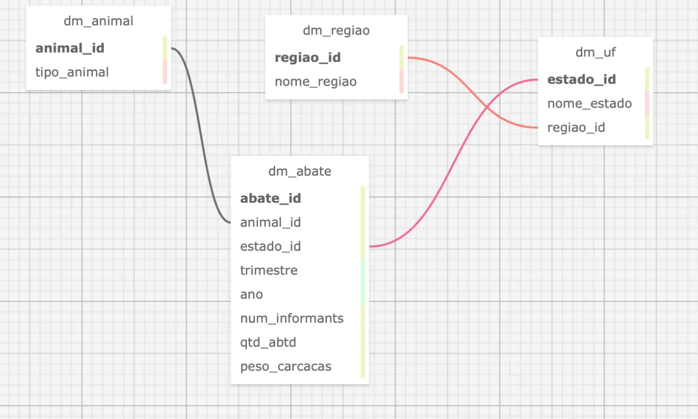

# Projeto de Banco de Dados de Abates

Este projeto tem como objetivo criar e consultar um banco de dados relacional para análise de informações sobre o abate de animais por região e estado. O projeto inclui a modelagem de dados, criação de tabelas, e consultas SQL para obter informações úteis sobre os abates realizados.

## Integrantes

- Eduardo Carvalho Santos - RM559438
- Gustavo Rocha De Castro - RM5608318
- Jhonatan Salles - RM554190

## Diagrama de Entidade-Relacionamento (MER)

O diagrama MER do projeto está localizado na pasta `/diagrams/MER.png` e descreve a estrutura relacional do banco de dados, incluindo as entidades e seus relacionamentos.

## Estrutura do Projeto

O projeto está estruturado em diferentes arquivos, cada um com uma finalidade específica:

- **Dicionário de Dados**: Descrição das tabelas e dos campos do banco de dados.
- **Modelo Relacional**: Representação física das tabelas no banco de dados.
- **Criação das Tabelas**: Arquivo `create_tables.sql` que contém o script para criação das tabelas normalizadas.
- **Consultas SQL**: Arquivo `queries.sql` que contém exemplos de consultas SQL para análise dos dados.

## População da Base de Dados

A base de dados foi populada com informações fornecidas pelo IBGE (Instituto Brasileiro de Geografia e Estatística), garantindo a precisão e relevância dos dados utilizados para análise.

## Consultas SQL Implementadas para análise:

As consultas disponíveis incluem:

1. **Total de abates de bovinos por região no 2º Trimestre de 2024**
2. **Peso total das carcaças de frangos por estado**
3. **Estados com maior número de informantes para abate de suínos**

Essas consultas fornecem informações essenciais para o monitoramento e análise das atividades de abate em diferentes regiões e estados.

## Como Executar

Para executar o projeto, siga os seguintes passos:

1. Clone este repositório para o seu ambiente local.
2. Utilize um SGBD (Sistema de Gerenciamento de Banco de Dados) compatível, como MySQL ou PostgreSQL.
3. Execute o script `create_tables.sql` para criar as tabelas no banco de dados.
4. Utilize o arquivo `queries.sql` para executar as consultas e obter os resultados desejados.

## Tecnologias Utilizadas

- **SQL**: Linguagem de consulta para manipulação e análise dos dados.

## Licença

Este projeto está licenciado sob a MIT License - consulte o arquivo LICENSE para mais detalhes.
